## CUDA Path Tracer

||
|:--:|
|What Remains of Desert Roses|

Author: Alan Lee ([LinkedIn](https://www.linkedin.com/in/soohyun-alan-lee/))

This project is a path tracer designed and implemented using C++, OpenGL, and CUDA.

The path tracer currently supports the following features:
* Path termination based on stream compaction and russian roulette
* Stochastic sampled antialiasing and ray generation using stratified sampling
* Physically-based depth-of-field
* Environment mapping
* Open Image AI Denoiser  
---
* Loading and reading a json scene description format
* Lambertian (ideal diffuse), metal (perfect specular with roughness parameter), dielectric (refractive), and emissive materials
* OBJ loading with texture mapping and bump mapping
* Support for loading jpg, png, hdr, and exr image formats and saving rendered images as png files
* Hierarchical spatial data structure (bounding volume hierarchy)  
---
* Restartable path tracing

## Contents

* `src/` C++/CUDA source files.
* `scenes/` Example scene description JSON files.
* `img/` Renders of example scene description files.
* `renderstates/` Paused renders are stored at and read from this directory.
* `external/` Includes and static libraries for 3rd party libraries.

## Running the Code

You should follow the regular setup guide as described in [Project 0](https://github.com/CIS5650-Fall-2024/Project0-Getting-Started/blob/main/INSTRUCTION.md#part-21-project-instructions---cuda).

The main function requires either a scene description file or a render state directory. For example, the user may call the program with one as an argument: `scenes/sphere.json` for scene description files and `renderstates/` for the render state directory. (In Visual Studio, `../scenes/sphere.json` and `../renderstates/`)

If you are using Visual Studio, you can set this in the `Debugging > Command Arguments` section in the `Project Properties`. Make sure you get the path right - read the console for errors.

You may also toggle various features such as contiguous memory sorting, BVH usage, and OIDN usage in `flags.h` file.

### Controls

Click, hold, and move `LMB` in any direction to change the viewing direction.\
Click, hold, and move `RMB` up and down to zoom in and out.\
Click, hold, and move `MMB` in any direction to move the LOOKAT point in the scene's X/Z plane.\
Press `Space` to re-center the camera at the original scene lookAt point.

Press `S` to save current image.\
Press `Escape` to save current image and exit application.\
Press `P` to save current state of rendering to be resumed at a later time.

## Analysis

* Tested on: Windows 10, AMD Ryzen 5 5600X 6-Core Processor @ 3.70GHz, 32GB RAM, NVIDIA GeForce RTX 3070 Ti (Personal Computer)
* CUDA : 1D blocksize 128, 2D blocksize 8x8
* Max ray depth = 8
* Image size : 800x800 pixels

The raw data for both qualitative and quantitative observations were made using above testing setup. For the numerical measurements of the performance, please refer to `rawdata.xlsx` at the root of this repository. The render time for each frame was measured using IMGUI's IO framerate data.

The performance analysis was conducted using two scenes of similar scene geometry complexity. The first image below showcases an open scene (with most rays not intersecting with the scene geometries), and the second image showcases a closed scene (with minimal rays escaping the scene before meeting other termination conditions). Each scene was rendered with 50 samples per pixel, where all conditions were left equal except for the target configuration being analyzed.

||
|:--:|
|Open scene with Spot|

||
|:--:|
|Closed scene with Spot|

### Core features

Each scene under each configuration was ran **fifty** iterations to reduce the performance effect of randomness of sampling methods and testing environment. The measures were then averaged to create charts to be shown below.

|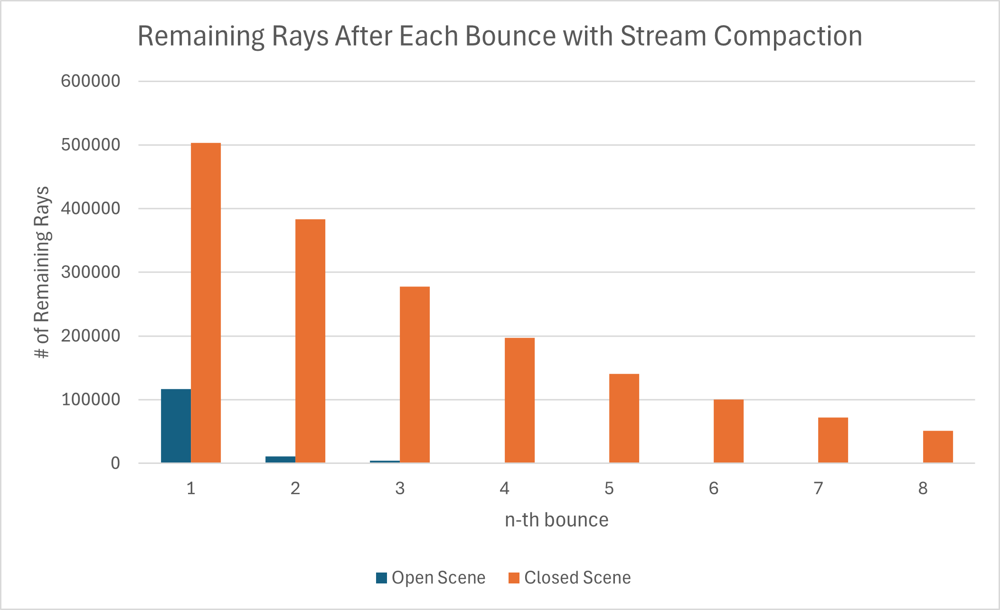|
|:--:|
|Remaining Rays after N-th Bounce for open and closed scenes|

|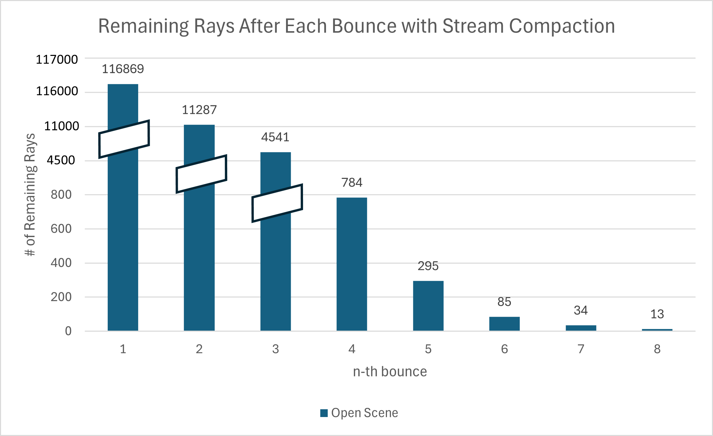|
|:--:|
|Remaining Rays after N-th Bounce for open scene|

|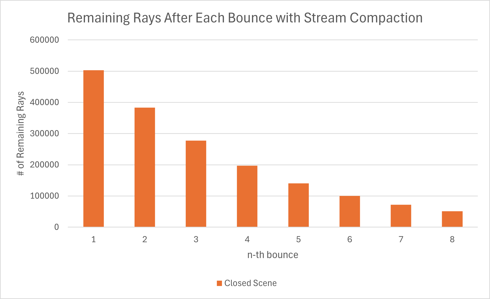|
|:--:|
|Remaining Rays after N-th Bounce for closed scene|

Note that as our image size is set to 800x800, we generate 640,000 rays in each iteration. Also note that a ray is terminated if 1. the ray hit a light source or 2. the ray missed every geometry in the scene.

When it comes to comparative analysis, we can immediately notice the significant gaps in the number of remaining rays between open and closed scenes. This is as expected as in an open scene most of the rays will not intersect with any of the scene geometries, dive straight to environment map sampling, and get terminated. On the other hand, in a closed scene, only a handful of rays that gets directed to the light source are terminated and most of the remaining rays keep bouncing around the scene. On average, the stream compaction for our open scene terminated **71**% of rays at each bouce, whereas the stream compaction for our closed scene terminated **27**% of rays at each bounce.

Naturally, since so many of the rays are terminated for open scenes with stream compaction, the rendering time per frame of an open scene is on average **four** times faster across all number of bounces compared to that of a closed scene. This is indeed as expected from the theoretical consideration of our implemetation.

### Extra features

We will discuss additional features supported in the order of asset loading, scene construction, path tracing, post processing, and utility support.

Each scene under each configuration was ran **three** times to reduce the performance effect of randomness of sampling methods and testing environment. The measures were then averaged to create charts to be shown below.

#### Arbitrary mesh (OBJ) and image (jpg, png, hdr, exr) loading

||
|:--:|
|Yeahright OBJ model with lambertian white material|

Most of arbitrary mesh and image loading feature is supported by third-party C++ programs such as tinyobj, stb_image, and tinyexr. Once the raw data is loaded into appropriate temporary arrays, we parse the information to our path tracer's internal data representation.

All obj meshes are triangulated on load and gets stored as individual triangles. Each triangle is a `Geom` struct populated with appropriate material type, texture index, and vertex position/normal/uv arrays. The object's local transformations within the obj files are already applied to vertices and not loaded separately. The global transformations on the entire mesh as described in the scene file are however stored per geometry. The array of all geometries once generated is used to construct our hierarchical spatial data structure, after which it remains constant until the end of the program.

Similarly, any images loaded by third-party programs are meant to be used for some kind of texture (albedo, normal, etc). Each pixel read in an image gets appended to the end of a global `glm::vec4` vector. The pixels are stored sequentially from bottom left to top right of the image (image is flipped appropriately to achieve this).

For performance analysis on arbitrary mesh loading, please refer to the "Hierarchical spatial data structure (BVH)" section.

#### Texture mapping and Normal mapping

|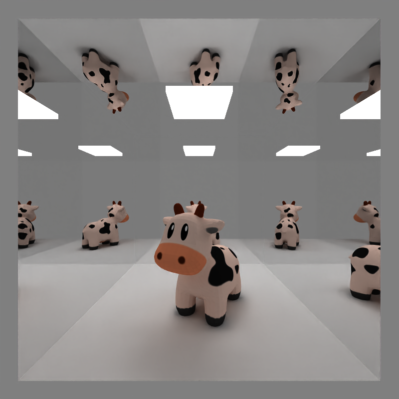|
|:--:|
|Spot OBJ with image texture in a mirror Cornell box|

Texture mapping and normal mapping (aka bump mapping) extends upon loaded mesh vertex normal and texture coordinate data as well as image texture data. For each valid ray-geometry intersection point, we compute the interpolated normal and texture coordinates based on its barycentric coordinates. For texture mapping, we use this interpolated uv-coordinates to sample the corresponding image texture using bilinear interpolation. For normal mapping, we use this interpolated normal to compute tangent and bitangent, which then gets used with sampled normal map value to offset the surface normal.

#### Hierarchical spatial data structure (BVH)

||
|:--:|
|BVH visualization of nodes at level 1|

|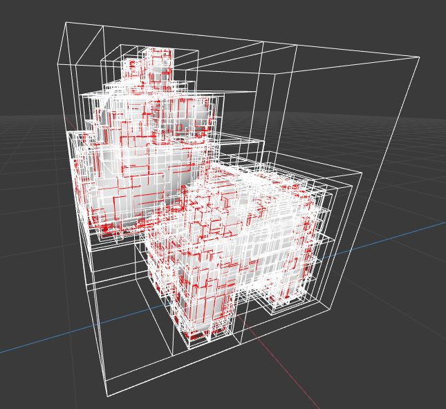|
|:--:|
|BVH visualization of nodes at a deeper level|

(above images are conceptual demonstration using [Scotty3D](https://github.com/CMU-Graphics/Scotty3D))

A naive ray-scene intersection checks each ray against every primitive present in the scene. This means intersection test cost scales linearly with the scene complexity, which is extremely undesirable. We therefore include a bounding volume hierarchy (BVH) implementation to support accelerated ray-scene intersection scheme. The implementation details can be found at `bbox.h`, `bvh.h`, and `bvh.cpp`.

A BVH is a hierarchical spatial data structure that partitions primitives into a binary tree of distinct bounding volumes that may spatially overlap, but is guaranteed to have distinct leaf elements. The most important assumption for our BVH implementation is that the input array of geometries in scene stays constant. Thus, we generate BVH once at scene loading phase and reuse it throughout the rendering procedures. It should also be noted that our bounding volumes are always axis-aligned.

Each element in the tree is represented as a `Node` struct. A `Node` describes current node's bounding volume/box, the starting index of current node's elements in the geometry array, the number of elements included in this node, and the index of left and right children nodes. During BVH construction, we recursively evaluate the best partitioning scheme for the current node according to [surface area heuristic](https://www.pbr-book.org/3ed-2018/Primitives_and_Intersection_Acceleration/Bounding_Volume_Hierarchies#TheSurfaceAreaHeuristic), partition relevant range of geometry data given the best partitioning scheme, and create children nodes and continue the recursion until a leaf condition is met (geometry range less than some number).

Intersecting a ray with BVH performs ray-box intersection check. If the intersection exists and may contain closer geometry intersection than the closest intersecting distance (initially set to `FLT_MAX`) so far, we add left and right children nodes to the exploration stack and continue. If the current node is a leaf node, we iterate through all of its geometries and compute the closest intersection.

Currently the BVH construction is done with CPU and the intersection parallelized per ray with GPU. However, within each ray, the recursive step is a big while loop with many branching conditions and memory reads. Considering that a hypothetical CPU version would be entirely sequential, our implementation is expected to have considerable gains from ray parallelization alone. However, a more optimized memory management scheme may lead to further noticeable performance gains.

Scene intersection using BVH dramatically improved rendering performance in both open and closed scenes.

|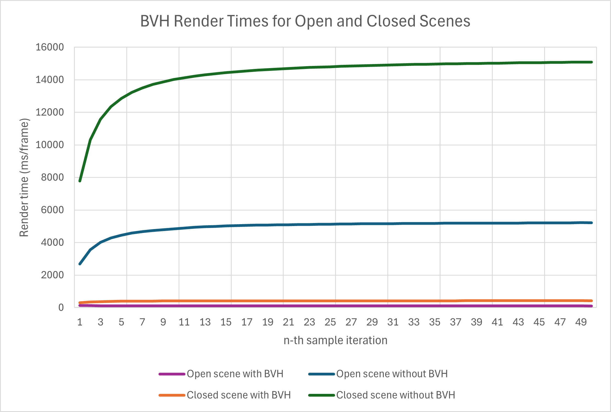|
|:--:|
|BVH Render Speed (ms/frame) (lower is better)|

|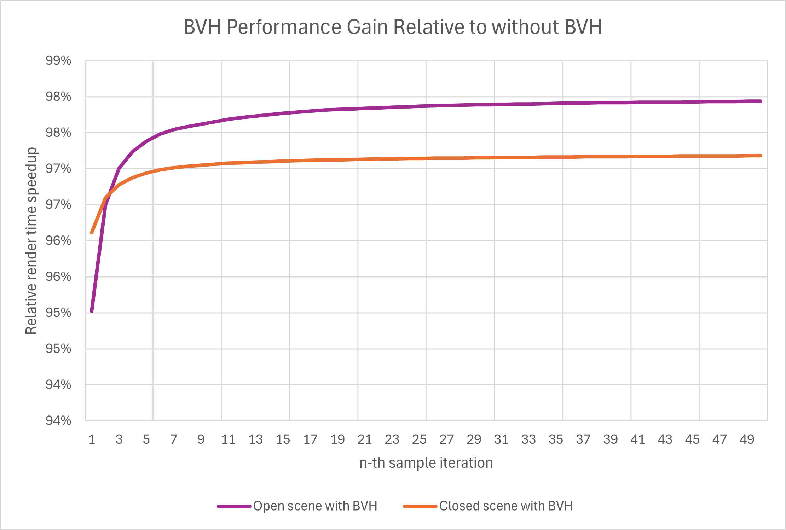|
|:--:|
|BVH Speedup Relative to no BVH (higher is better)|

For our open scene, we get render speeds of on average **4960**ms per frame without BVH and **111**ms per frame with BVH. For our closed scene, we get render speeds of on average **14319**ms per frame without BVH and **415**ms per frame with BVH. This shows that BVH path termination for open scenes with minimal inter-mesh scattering experience on average **97.7%** of render speed performance gain and for closed scenes with maximal inter-mesh scattring experiece on average **97.1%** of render speed performance gain.

We can observe that our BVH implementation benefits rendering speed of both open and closed scenes about equally. This is as expected as both scenes were designed to have approximately equivalent scene geometry complexity and intersection costs.

#### Stratified sampling and Checker material

|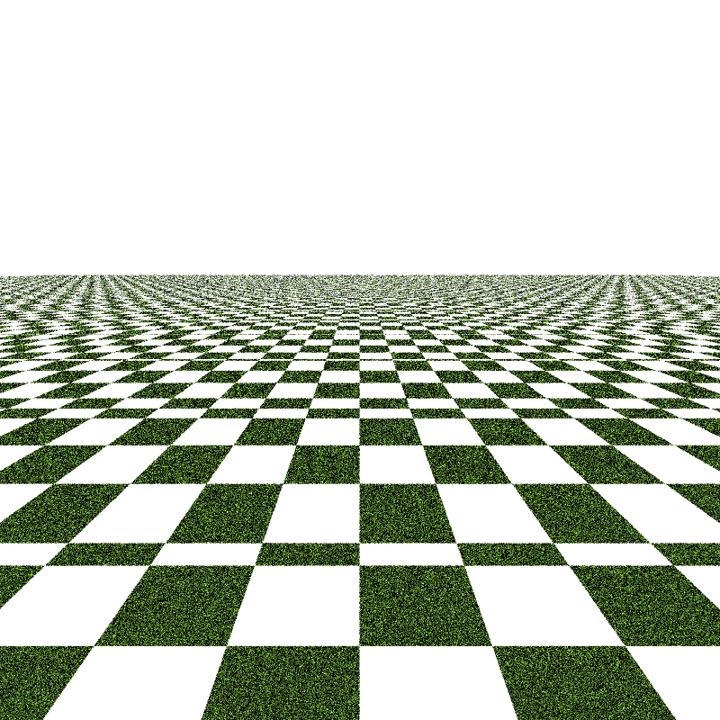|
|:--:|
|Stratified sampling of 1x1 grid|

||
|:--:|
|Stratified sampling of 2x2 grid|

With stochastic jittering of camera rays, antialiasing comes for free. However, leaving the amount of jitter to be random across the whole pixel makes the path tracer susceptible to big gaps and clumping between sampled points, potentially leading to aliasing artifacts and wasted computation.

To combat this, we perform [stratified sampling](https://pbr-book.org/3ed-2018/Sampling_and_Reconstruction/Stratified_Sampling). We split up each pixel into a uniform grid of cells, after which at each iteration we sample a random direction from within a grid corresponding to current iteration. This approach provably cannot increase the variance but will achieve a significantly more uniform coverage of the pixel area.

A checker material was created to test the performance of stratified sampling. A checker material shades the surface based on the sign of sin of xyz coordinates of intersecting point in world coordinates. Both of the above images were sampled with 4 samples per pixels (or 4 iterations). The left image took 4 samples uniformly randomly across each entire pixel, whereas the right image took 4 samples with each sample from a distinct cell in the 2x2 grid block per pixel. The difference may not be apparent from a far, but if we take a closer look...

|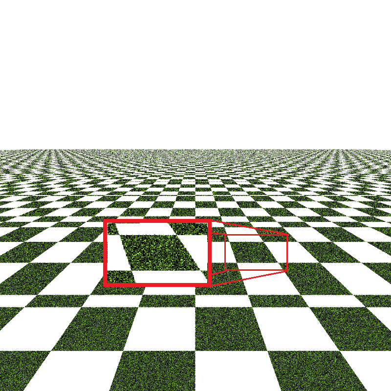|
|:--:|
|Stratified sampling of 1x1 grid magnified|

||
|:--:|
|Stratified sampling of 2x2 grid magnified|

... we can observe that stratified sampling greatly reduces aliasing issues that occur with purely random uniform sampling.

#### Physically-based depth of field

||
|:--:|
|Defocus blur demonstration with 4 cubes|

Physically-based depth of field is used to simulate defocus blur and bokeh. This technique requires implementation of focal length, aperture size, and aperture shape. Our implementation currently assumes our aperture shape to always be perfectly circular (meaning bokeh will always be circular too), so the aperture size dictates the radius of our aperture.

With these parameters, we alter each usually sampled camera ray. We firstly sample a random point on the aperture to be our new ray origin. We then compute the position on the focal plane that our original ray points to and recompute the new ray direction to that point from our new origin.

The end result is a physical simulation of a circle of confusion. Only the rays hitting geometry within depth-of-field of the focal plane converges to an acceptable sharpness whereas rest of the scene gets blurrier as the difference in depth increases.

#### Refraction

||
|:--:|
|Spot with a refractive wavy surface in front|

[Specular transmission](https://www.pbr-book.org/3ed-2018/Reflection_Models/Specular_Reflection_and_Transmission), commonly called as refraction, models the physical behavior of light traveling at different speeds in different mediums. This causes the light to bend at various angles depending on the ratio of refractive indices between the light's entering and exiting materials.

A glass material can both reflect and refract light. The ration of light reflected vs refracted is governed by the dielectric Fresnel equations. Therefore, our implementation samples the reflected or refracted ray direction with probability proportional to the Fresnel reflectance. The ray direction after refraction is computed according to Snell's law.

#### Imperfect specular

|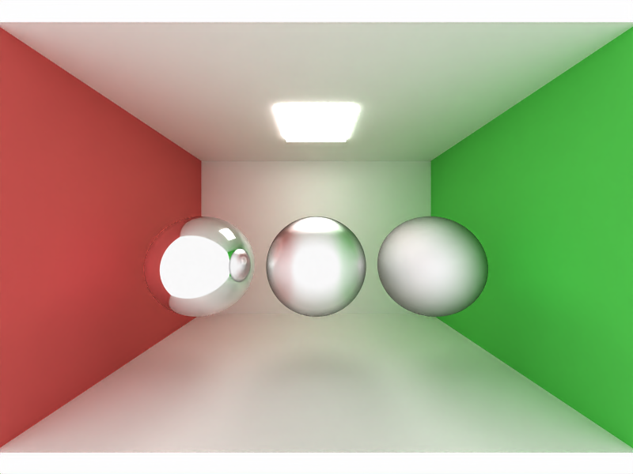|
|:--:|
|Specular material roughness demonstration|

In our real world, a "perfect mirror" is a theoretical concept. Most objects will have some imperfections on the surface that cause a degree of blurriness on the surface. We simulate these imperfect specular reflections using the `roughness` parameter.

We implement this concept by perturbing the specular reflection direction by a random direction in a sphere with radius `roughness`. That is, we artificially introduce randomness that scales with material roughness to the scattering ray directions. As a result of this, roughness of 0 results in a perfect mirror whereas roughness of 1 is essentially a perfect diffuse material.

Above image showcases 1. Roughness 0 (perfect mirror), 2. Roughness 0.5 (glossy mirror), and 3. Roughness 1.0 (perfect diffuse) from left to right order.

#### Environment mapping

|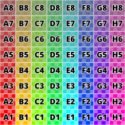|
|:--:|
|Original texture used for environment mapping|

|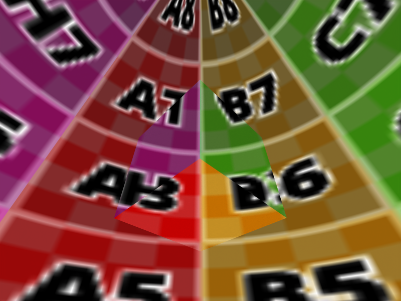|
|:--:|
|Environment mapping applied with a mirror cube|

Environment maps use captures of the real-world illumination data to encapsulate the scene with a spherical globe of infinite radiance. Our implementation detects any rays that miss the scene (i.e. ray-scene intersection reports no intersections) and converts their ray directions into spherical coordinates, which then gets mapped to a uv coordinate to be used for sampling the environment map texture image.

#### Russian Roulette path termination

[Russian Roulette](https://pbr-book.org/3ed-2018/Monte_Carlo_Integration/Russian_Roulette_and_Splitting) improves the efficiency of Monte Carlo estimator by increasing the likelihood that each sample will have a significant contribution to the result. With explicit throughput computation, we probabilistically terminate paths based on if a random number in 0~1 is greater than the luminance of the throughput or not. The throughput of surviving paths are scaled by the probability of survival. This allows our Russian Roulette estimator to equal the expected value of the original Monte Carlo estimator without bias.

A key observation of this technique is that pure path termination scheme based on Russian Roulette removes the need for arbitrary ray depth limit and makes unbiased render possible. However, for the sake of consistent performance and debugging purposes, our implementation still allows the users to set an arbitrary ray depth limit.

We were able to quantitatively measure the performance improvement of Russian Roulette path termination in both open and closed scenes.

||
|:--:|
|Russian Roulette Render Speed (ms/frame) (lower is better)|

|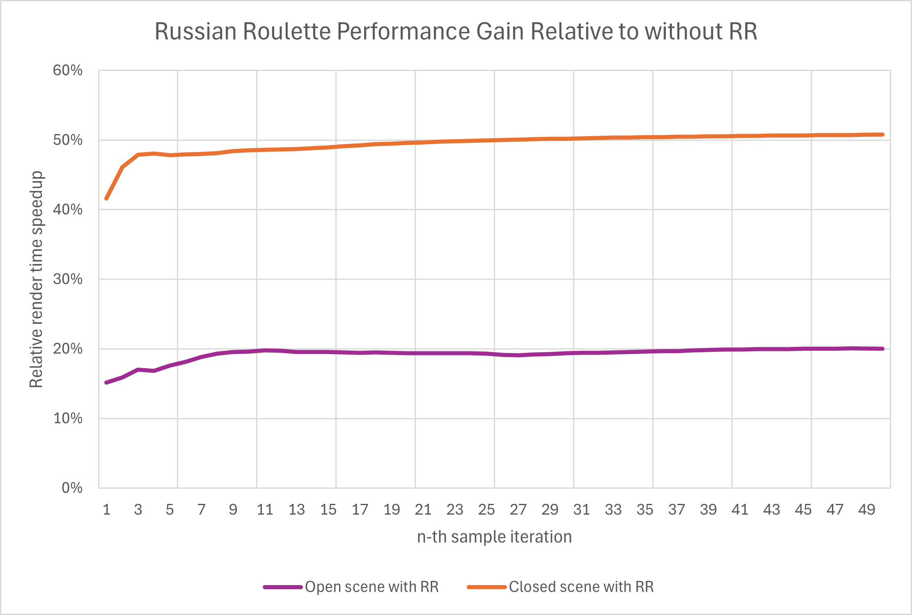|
|:--:|
|Russian Roulette Speedup Relative to no Russian Roulette (higher is better)|

For our open scene, we get render speeds of on average **135**ms per frame without Russian Roulette and **109**ms per frame with Russian Roulette. For our closed scene, we get render speeds of on average **812**ms per frame without Russian Roulette and **409**ms per frame with Russian Roulette. This shows that Russian Roulette path termination for open scenes with minimal inter-mesh scattering experience on average **19.3%** of render speed performance gain and for closed scenes with maximal inter-mesh scattring experiece on average **49.5%** of render speed performance gain.

We can observe a drastic performance especially in the closed scene with Russian Roulette path termination. This is because as the rays keep scattering around the scene, the throughput keeps getting scaled smaller by the attenuation of each surface interaction, making the bouncing rays more likely to be terminated. This means many rays beyond the first 3~4 scatterings hold throughput so low that they most likely get terminated by the Russian Roulette process, leading to our path tracer launching exponentially smaller number of threads after each iteration. This effect is best shown in a closed scene with many more inter-mesh scatterings compared to an open scene as expected.

#### Open Image AI Denoiser

||
|:--:|
|Cornell box with OIDN off|

|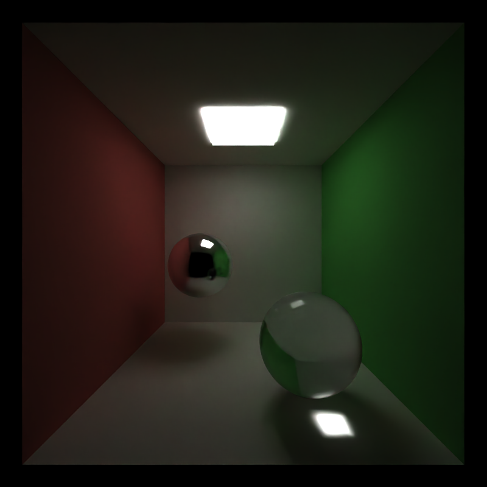|
|:--:|
|Cornell box with OIDN on|

The [Intel Open Image Denoise](https://github.com/RenderKit/oidn) is an open source library for high-quality AI-based denoising for images rendered with ray tracing.

Our integration of OIDN utilizes auxillary buffers of albedo and normal data. The albedo and normal buffers store information about the raw material color of camera ray's first bounce and the normal at that first bounce intersection point respectively. We use these data to perform basic denoising on every rendered frame presented to the GUI. If the user saves current image or if we reach the target iterations, we perform denoising with prefiltering as described by OIDN specification to further improve our denoised image quality.

||
|:--:|
|Open scene with OIDN off|

||
|:--:|
|Open scene with OIDN on|

||
|:--:|
|Closed scene with OIDN off|

||
|:--:|
|Closed scene with OIDN on|

We observed drastic improvements in image quality given the 50 samples per pixel limitation on both open and closed scenes. This qualitative visual improvement however comes at a cost of additional filter execution time.

||
|:--:|
|OIDN Render Speed (ms/frame) (lower is better)|

||
|:--:|
|OIDN Performance Loss Relative to no OIDN (lower is better)|

For our open scene, we get render speeds of on average **111**ms per frame without OIDN and **121**ms per frame with OIDN. For our closed scene, we get render speeds of on average **415**ms per frame without OIDN and **435**ms per frame with OIDN. This shows that OIDN filter executions for open scenes with minimal inter-mesh scattering experience on average **8.39%** of render speed performance loss and for closed scenes with maximal inter-mesh scattring experiece on average **4.89%** of render speed performance loss.

We suspect the reason for OIDN being significantly more costly with open scenes to be unpopulated entries for albedo and normal arrays when the camera rays miss the all geometries. The lack of information passed into the OIDN auxillary buffers may lead to underdetermined denoising process that causes a longer compute time to resolve the input image into a denoised solution.

#### Re-startable path tracing

Re-startable path tracing requires storing and loading of some representation of current scene data. For our implementation, the user may temporarily pause and store the entirety of current state of rendering to text files. By passing the directory of the generated files to the arguments of this application at launch, the user may resume the rendering process without losing any data.

Currently most of the data written to save files are written in plain text, so the size of the save files are very large (up to hundreds of megabytes for very complex scenes). Researching better data representation and compression schemes beyond simply converting the storage format to binary is an area of improvement to be worked on in the future.

## Other cool renders

|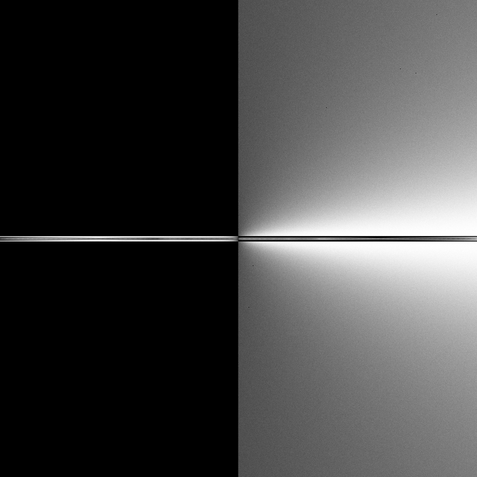|
|:--:|
|Checker texture viewed horizontally|

Above render was achieved by having a checker texture board lay perfectly horizontal to the middle of the camera and have light bounce off of both surfaces.

## Attributions and Credits

### Resources
Belfast Sunset HDR image : https://polyhaven.com/a/belfast_sunset \
Bump map images (Box, Bor normal) : https://gamemaker.io/en/blog/using-normal-maps-to-light-your-2d-game \
Desert Rose model : https://www.cs.cmu.edu/~kmcrane/Projects/ModelRepository/ \
Red Laterite Soil Stones 4k jpg : https://polyhaven.com/a/red_laterite_soil_stones \
Spot model and texture : https://www.cs.cmu.edu/~kmcrane/Projects/ModelRepository/ \
UV Debug Texture png : https://github.com/CMU-Graphics/Scotty3D/blob/main/media/textures/uv-debug-texture.png \
Yeahright model : https://www.cs.cmu.edu/~kmcrane/Projects/ModelRepository/

### Conceptual and Code
Bump mapping : https://www.opengl-tutorial.org/intermediate-tutorials/tutorial-13-normal-mapping/ \
BVH : https://github.com/CMU-Graphics/Scotty3D \
OIDN : https://github.com/RenderKit/oidn \
stb image : https://github.com/nothings/stb \
tinyexr : https://github.com/syoyo/tinyexr \
tinyobj : https://github.com/tinyobjloader/tinyobjloader \
Various theoretical and implementation details of path tracing : https://pbr-book.org/